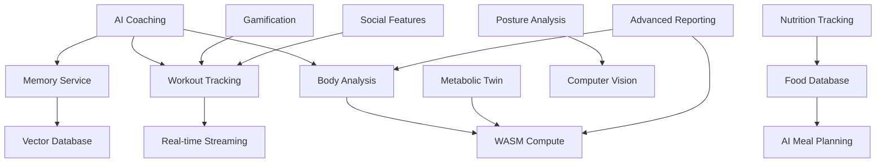

# Feature Catalog

**Status**: ⏳ Awaiting feature analysis from senior-ba  
**Last Updated**: 2025-04-27

This document catalogs all AIVO features with business value, user stories, acceptance criteria, and technical specifications. It serves as the single source of truth for product requirements.

> **Note**: This is a living document. Features will be added, modified, and deprecated as the product evolves. Each feature should have an associated ADR (Architecture Decision Record) in `docs/architecture/decisions/`.

---

## Table of Contents

- [Feature Prioritization](#feature-prioritization)
- [Feature Details](#feature-details)
- [Feature Dependencies](#feature-dependencies)
- [Success Metrics](#success-metrics)
- [Roadmap](#roadmap)

---

## Feature Prioritization

| Priority | Feature | Status | Target Release |
|----------|---------|--------|----------------|
| P0 (Critical) | AI Coaching | 🚧 In Progress | v1.1 |
| P0 (Critical) | Workout Tracking | ✅ Shipped | v1.0 |
| P0 (Critical) | Body Analysis | ✅ Shipped | v1.0 |
| P1 (High) | Posture Analysis | 🚧 In Progress | v1.2 |
| P1 (High) | Metabolic Twin | 🚧 In Progress | v1.2 |
| P1 (High) | Nutrition Tracking | 🚧 Planning | v1.3 |
| P2 (Medium) | Gamification | 🚧 Planning | v1.4 |
| P2 (Medium) | Social Features | 📋 Backlog | v2.0 |
| P2 (Medium) | Advanced Reporting | 📋 Backlog | v2.0 |
| P3 (Low) | Integration Marketplace | 📋 Backlog | v2.1+ |

---

## Feature Details

### P0: AI Coaching (Chat)

**Business Value**: Provides personalized fitness guidance, increasing user engagement and retention. Differentiates AIVO from basic tracking apps.

**User Stories**:
- As a user, I want to ask questions about my workouts and get instant answers
- As a user, I want the AI to remember my goals and preferences
- As a user, I want context-aware advice based on my biometric data

**Acceptance Criteria**:
- [ ] AI responds within 2 seconds
- [ ] AI references user's workout history, body metrics, and goals
- [ ] Conversations are persisted and searchable
- [ ] Memory extraction identifies key facts (injuries, preferences, goals)
- [ ] Rate limiting: 100 messages per user per day

**Technical Specs**:
- **API Endpoint**: `POST /api/ai/chat`
- **WASM Integration**: `@aivo/aivo-compute` for fitness calculations
- **Memory Service**: `@aivo/memory-service` for context building
- **AI Models**: OpenAI GPT-4o, Google Gemini (auto-selected)
- **Database**: New `conversations` and `memory_facts` tables

**Related ADRs**:
- ADR-001: AI Model Selection Strategy
- ADR-002: Memory Architecture

---

### P0: Workout Tracking

**Business Value**: Core functionality - users must be able to log and track workouts.

**User Stories**:
- As a user, I can create custom workouts with exercises
- As a user, I can log workout sessions with sets/reps/weights
- As a user, I can view my workout history and progress
- As a user, I get real-time guidance during live workouts

**Acceptance Criteria**:
- [ ] CRUD operations for workouts and exercises
- [ ] Live workout mode with timer and set tracking
- [ ] Progress charts (strength gains over time)
- [ ] Exercise library with proper form tips
- [ ] Offline capability (mobile)

**Technical Specs**:
- **API Endpoints**: `GET/POST/PUT/DELETE /api/workouts`
- **Live Workout**: WebSocket connection for real-time updates
- **Database**: `workouts`, `exercises`, `workout_sessions` tables
- **Mobile**: Camera integration for form checking (planned)

**Related ADRs**:
- ADR-003: Real-time Workout Streaming
- ADR-004: Offline-First Mobile Architecture

---

### P0: Body Analysis

**Business Value**: Users want to track their fitness progress visually and numerically.

**User Stories**:
- As a user, I can log my weight, measurements, and body fat
- As a user, I can see trends and charts of my body metrics
- As a user, I get AI insights about my body composition changes
- As a user, I can upload progress photos

**Acceptance Criteria**:
- [ ] Log weight, body fat, circumferences (multiple sites)
- [ ] View historical trends with interactive charts
- [ ] AI-generated body insights (weekly/monthly)
- [ ] Photo upload with R2 storage
- [ ] Body heatmap visualization

**Technical Specs**:
- **API Endpoints**: `GET/POST /api/body/metrics`, `GET /api/body/insights`
- **Storage**: Cloudflare R2 for photos
- **WASM**: `@aivo/aivo-compute` for body fat calculations, BMI, etc.
- **Database**: `body_metrics`, `body_photos`, `body_insights` tables

---

### P1: Posture Analysis

**Business Value**: Premium feature that provides value-added analysis for injury prevention and form correction.

**User Stories**:
- As a user, I can upload a video or photo of my exercise
- As a user, I get AI feedback on my posture and form
- As a user, I receive corrections to prevent injury

**Acceptance Criteria**:
- [ ] Video upload support (max 60 seconds)
- [ ] Pose estimation using ML model
- [ ] Form analysis for major lifts (squat, deadlift, bench)
- [ ] Scoring system (0-100) for posture quality
- [ ] Specific correction recommendations

**Technical Specs**:
- **API Endpoint**: `POST /api/posture/analyze`
- **WASM**: Pose estimation or TensorFlow.js integration
- **Storage**: R2 for video uploads
- **Database**: `posture_analyses` table with scores and feedback

**Related ADRs**:
- ADR-005: Computer Vision Architecture

---

### P1: Metabolic Twin

**Business Value**: Advanced personalization through metabolic simulation helps users optimize nutrition and training.

**User Stories**:
- As a user, I want a digital twin that simulates my metabolism
- As a user, I can see how diet/exercise changes affect my body
- As a user, I get personalized calorie and macro recommendations

**Acceptance Criteria**:
- [ ] Metabolic profile based on user metrics (age, weight, activity)
- [ ] Simulation of calorie deficit/surplus effects
- [ ] Predictive modeling (weight loss/gain projections)
- [ ] Dynamic macro recommendations
- [ ] Integration with nutrition tracking

**Technical Specs**:
- **API Endpoints**: `GET/POST /api/metabolic/twin`, `POST /api/metabolic/simulate`
- **WASM**: `@aivo/aivo-compute` for BMR/TDEE calculations
- **Database**: `metabolic_profiles`, `simulation_results` tables

---

### P1: Nutrition Tracking

**Business Value**: Complete fitness solution - users can track diet alongside exercise.

**User Stories**:
- As a user, I can log meals and track calories/macros
- As a user, I can search a food database
- As a user, I get AI-powered meal suggestions
- As a user, I can set nutrition goals and track progress

**Acceptance Criteria**:
- [ ] Food database integration (USDA or similar)
- [ ] Barcode scanner for packaged foods
- [ ] Manual food entry with macro breakdown
- [ ] Daily/weekly nutrition summaries
- [ ] AI meal planning based on goals

**Technical Specs**:
- **API Endpoints**: `GET/POST /api/nutrition/logs`, `GET /api/nutrition/food/search`
- **Database**: `food_logs`, `food_database`, `nutrition_goals` tables
- **Storage**: R2 for barcode images (optional)

---

### P2: Gamification Progression System

**Business Value**: Drive user engagement and habit formation through XP, levels, streaks, and rewards. Gamification increases workout consistency and long-term retention by providing tangible milestones and recognition.

**User Stories**:
- As a user, I earn XP for completing workouts and daily check-ins
- As a user, I can see my current level and progress to next level
- As a user, I maintain workout streaks and earn bonuses for consistency
- As a user, I can purchase streak freezes to protect my streak during missed days
- As a user, I earn badges for reaching specific milestones (100 workouts, 30-day streak, etc.)
- As a user, I can view my points balance and transaction history
- As a user, I can share my achievements on social media to earn bonus points
- As a user, I can compete on global and friend leaderboards

**Acceptance Criteria**:
- [ ] XP awarded automatically: 10 points per workout, 10 points per daily check-in, 25 points for sharing
- [ ] Level progression formula: `xpToNextLevel = 100 * 1.5^(level - 1)`
- [ ] Streak tracking based on consecutive days with at least 1 workout or check-in
- [ ] Streak freeze purchasable for 50 points, max 3 active freezes
- [ ] Badge system with 15+ badges covering streaks, workouts, points, consistency
- [ ] Leaderboards (global, friends, club) updated hourly with 5-minute cache
- [ ] All point transactions logged with audit trail
- [ ] Push notifications for level up, badge earned, streak milestone
- [ ] Share generation creates branded SVG images with stats

**Technical Specs**:
- **API Endpoints**: See [SOCIAL_FEATURES_API.md](./SOCIAL_FEATURES_API.md#gamification)
  - `GET /gamification/streak/:userId` - Get streak profile
  - `POST /gamification/checkin` - Daily check-in
  - `POST /gamification/freeze/purchase` - Buy streak freeze
  - `POST /gamification/freeze/apply` - Apply freeze to missed day
  - `GET /gamification/points/:userId` - Points balance & history
  - `GET /gamification/leaderboard` - Global leaderboard (cached)
  - `GET /gamification/leaderboard/rank/:userId` - User's rank
  - `POST /gamification/share/generate` - Generate share SVG
  - `POST /gamification/share/record` - Record share (+25 points)
- **Database**: `gamification_profiles`, `daily_checkins`, `streak_freezes`, `point_transactions`, `badges`, `achievements`, `leaderboard_snapshots`, `leaderboards`
- **Cache**: KV namespace for leaderboard data (TTL 5 minutes)
- **Cron Jobs**: 
  - Nightly leaderboard recalculation
  - Daily streak freeze expiration cleanup
- **Webhooks**: `gamification.level_up`, `gamification.streak_milestone`, `gamification.badge_earned`
- **Rate Limits**: 1 check-in per user per day, 100 leaderboard reads per minute
- **Related ADRs**: 
  - ADR-015: Streak Freeze Economy Design
  - ADR-016: Leaderboard Caching Strategy

**Success Metrics**:
- Day 7 retention: +15% for users with active streak
- Day 30 retention: +25% for users who reached level 5
- Gamification engagement: >50% of daily active users interact with gamification features

**Dependencies**:
- Task #100: KV Cache Implementation (for leaderboard caching)
- Database: `gamification_profiles` table exists, needs leaderboard materialization

**Implementation Notes**:
- Streak calculation: Check `daily_checkins` table for consecutive days; skip days with freeze
- Level formula produces: Level 1→2: 100 XP, Level 2→3: 225 XP, Level 3→4: 506 XP
- Leaderboard rank uses `points` descending, with `streakCurrent` as tiebreaker
- Share SVG generation uses SVG templates stored in R2 with dynamic data overlay

---

### P2: Social Features - Clubs, Events & Messaging

**Business Value**: Build community and social accountability to increase user retention, engagement, and organic growth through network effects. Users with social connections have 3x longer retention and higher lifetime value.

**User Stories**:
- As a user, I can create or join clubs based on fitness interests
- As a user, I can discover public clubs or receive private invitations
- As a user, I can participate in club chat to connect with members
- As a user, I can create and RSVP to club events (workouts, challenges, meetups)
- As a user, I can send direct messages to friends
- As a user, I receive real-time notifications for club activity, messages, and event reminders
- As a user, I can compete on club-specific leaderboards
- As a club owner/admin, I can manage members and moderate content

**Acceptance Criteria**:
- [ ] Club CRUD: Create, read, update, delete clubs with avatar and tags
- [ ] Membership management: Request to join (private), auto-join (public), approve/deny (admins)
- [ ] Club roles: owner, admin, moderator, member with permission hierarchy
- [ ] Club chat: Real-time messaging with WebSocket support, message history (100 msg limit)
- [ ] Events: Create with type (workout/challenge/meetup/webinar), time, location, capacity
- [ ] Event RSVP: Register, attend, cancel with status tracking and notifications
- [ ] Direct Messaging: 1:1 conversations with message history and read receipts
- [ ] Real-time presence: Show online status and active workout indicator
- [ ] Activity feed: Aggregated events (workout completed, badge earned, joined club)
- [ ] Notifications: In-app, push, and email for mentions, invites, messages, events
- [ ] Club leaderboards: Separate global and club-specific rankings
- [ ] Club challenges: Create challenge for club members with rewards

**Technical Specs**:
- **API Endpoints**: See [SOCIAL_FEATURES_API.md](./SOCIAL_FEATURES_API.md#social-features)
  
  **Clubs**:
  - `POST /clubs` - Create club
  - `GET /clubs` - List clubs (public only or with membership)
  - `GET /clubs/:clubId` - Get club details
  - `PATCH /clubs/:clubId` - Update club (owner/admin only)
  - `DELETE /clubs/:clubId` - Delete club (owner only)
  - `POST /clubs/:clubId/members` - Add/invite member
  - `GET /clubs/:clubId/members` - List members
  - `PATCH /clubs/:clubId/members/:userId` - Update role/status
  
  **Events**:
  - `POST /clubs/:clubId/events` - Create event
  - `GET /clubs/:clubId/events` - List club events
  - `PATCH /events/:eventId` - Update event
  - `POST /events/:eventId/rsvp` - RSVP to event
  - `GET /events/:eventId/participants` - Get attendee list
  
  **Messaging**:
  - `POST /messages` - Send message (DM/club/event)
  - `GET /messages/conversations` - List conversations
  - `GET /messages/:conversationId` - Get message history
  - `PATCH /messages/:messageId` - Edit/delete (sender only)
  - `POST /messages/:messageId/read` - Mark as read
  
  **Real-time WebSocket**:
  - `WS /ws` - WebSocket endpoint with subprotocols:
    - `presence` - User presence updates
    - `messages` - Real-time message delivery
    - `notifications` - Push notifications
    - `club:clubId` - Club-specific room (messages, events)
    - `event:eventId` - Event-specific room
    - `user:userId` - Direct messages to user
  
- **Database**: See [SOCIAL_FEATURES_DB_SCHEMA.md](./SOCIAL_FEATURES_DB_SCHEMA.md#social-features)
  - `clubs`, `club_members`, `events`, `event_participants`, `messages`, `leaderboards` (enhanced), `activity_feed`, `notifications` (extended), `websocket_sessions`
- **Cache**: 
  - Leaderboard data: KV with 5-minute TTL
  - Club member counts: KV with 1-minute TTL
  - Presence status: KV with 5-minute TTL
- **Cron Jobs**:
  - Hourly: Recalculate leaderboard rankings
  - Daily: Clean up stale WebSocket sessions, expired events
  - Weekly: Archive activity feed >90 days old
- **Webhooks**:
  - `club.created`, `club.updated`, `member.joined`, `member.left`
  - `event.created`, `event.rsvp_updated`, `event.starting_soon` (15 min before)
  - `message.sent`, `message.read`
  - `challenge.completed`, `badge.earned` (gamification integration)
- **Rate Limits**:
  - Messages: 100 per user per hour
  - Club creation: 5 per user per day
  - Event creation: 10 per club per week
  - WebSocket messages: 60 per minute per connection
- **Related ADRs**:
  - ADR-017: Real-time Messaging Architecture (WebSocket + Redis/KV)
  - ADR-018: Club Data Model and Permissions
  - ADR-019: Activity Feed Fan-out Strategy

**Success Metrics**:
- Social engagement: >30% of users join at least 1 club
- Club retention: Users in clubs have 40% higher 30-day retention
- Messaging: Average user sends >5 messages per week
- Event participation: >25% of club members RSVP to events
- Network effects: Viral coefficient >0.2 (invites sent per new user)

**Dependencies**:
- Task #100: KV Cache Implementation (for leaderboard and presence caching)
- Task #112: Real-time Features (WebSocket infrastructure)
- Gamification system (for club challenges and points integration)

**Implementation Notes**:
- **Club privacy**: Private clubs require invite/approval; public clubs auto-join
- **Message deletion**: Soft delete only hides from recipient; sender can edit within 15 minutes
- **Real-time rooms**: WebSocket connections can subscribe to multiple rooms (presence, club, event, user)
- **Activity feed fan-out**: When user completes workout, write to:
  - Own feed (`user_id = actor_id`)
  - All followers' feeds (query `social_relationships`)
  - Club feed if workout tagged (`club_id` set)
- **Leaderboard calculation**: Use transaction for atomic rank updates to prevent race conditions
- **Presence TTL**: KV entries expire after 5 minutes; WebSocket pings update `lastPingAt`

---

### P2: Advanced Reporting

**Business Value**: Professional users and coaches need detailed analytics.

**User Stories**:
- As a user, I can generate monthly progress reports
- As a user, I can export my data to PDF/Excel
- As a user, I can compare multiple metrics on custom charts
- As a coach, I can view all my athletes' data

**Acceptance Criteria**:
- [ ] PDF report generation (with charts)
- [ ] Excel export of all user data
- [ ] Customizable dashboard widgets
- [ ] Coach view with multi-athlete access
- [ ] Scheduled email reports (monthly)

**Technical Specs**:
- **API Endpoints**: `GET /api/export/report`, `GET /api/export/data`
- **WASM**: `@aivo/infographic-generator` for chart images
- **Storage**: R2 for generated reports
- **Database**: `reports`, `coach_athletes` tables

---

### P3: Integration Marketplace

**Business Value**: Expand ecosystem by integrating with third-party apps and devices.

**User Stories**:
- As a user, I can connect my Apple Health / Google Fit
- As a user, I can sync workouts with Strava, TrainingPeaks
- As a user, I can import/export my data
- As a developer, I can build integrations via API

**Acceptance Criteria**:
- [ ] Apple HealthKit integration (iOS)
- [ ] Google Fit integration (Android)
- [ ] OAuth connections to Strava, TrainingPeaks, MyFitnessPal
- [ ] Webhook system for real-time sync
- [ ] Public API documentation and SDKs

**Technical Specs**:
- **API Endpoints**: `GET/POST /api/integrations/connections`
- **Database**: `integrations`, `integration_data` tables
- **OAuth**: Multiple provider integrations
- **Webhooks**: Incoming/outgoing webhook handling

---

## Feature Dependencies

---

## Success Metrics

Each feature should define measurable KPIs:

| Feature | Primary KPI | Target | Measurement |
|---------|-------------|--------|-------------|
| AI Coaching | Engagement (messages/user/day) | >5 | Analytics |
| Workout Tracking | Workouts logged/user/week | >3 | Database |
| Body Analysis | Body metric entries/user/month | >4 | Database |
| Posture Analysis | User satisfaction score | >4/5 | Survey |
| Metabolic Twin | Feature adoption rate | >30% | Analytics |
| Nutrition Tracking | Food logs/user/day | >2 | Database |
| Gamification | Day 30 retention | >40% | Analytics |
| Social Features | Users with ≥3 friends | >25% | Database |
| Reporting | Report generation/user/month | >1 | Analytics |

---

## Roadmap

### v1.1 (Q2 2025) - AI Coaching Enhancement
- Multi-language support
- Voice input/output
- Integration with wearables

### v1.2 (Q2 2025) - Advanced Analytics
- Posture analysis v2 (real-time)
- Metabolic twin v1
- Improved body insights

### v1.3 (Q3 2025) - Nutrition
- Full nutrition tracking
- Barcode scanner
- AI meal planning

### v1.4 (Q3 2025) - Engagement
- Gamification system
- Social features MVP
- Push notifications

### v2.0 (Q4 2025) - Platform Expansion
- Coach/athlete mode
- Integration marketplace
- Advanced reporting
- Apple Watch / Wear OS app

---

## Document Conventions

### Feature Status

- ✅ **Shipped** - Feature is released and available to users
- 🚧 **In Progress** - Actively being developed
- 📋 **Planning** - Designed but not yet started
- ⏳ **Backlog** - Identified but not prioritized
- ❌ **Cancelled** - Feature was planned but cancelled

---

## Related Documentation

- **API Contracts**: See [API_CONTRACTS.md](./API_CONTRACTS.md) for endpoint specs
- **Database Schema**: See [DATABASE_SCHEMAS.md](./DATABASE_SCHEMAS.md) for table definitions
- **User Guides**: See [USER_GUIDES.md](./USER_GUIDES.md) for feature walkthroughs
- **ADRs**: See `docs/architecture/decisions/` for architectural decisions

---

**Document Owner**: Technical-docs (in coordination with senior-ba)  
**Next Review**: Weekly (or when features change)  
**Audience**: Product team, developers, stakeholders
