# AIVO Database ER Diagram

```mermaid
erDiagram
    users ||--o{ sessions : "has"
    users ||--o{ body_photos : "uploads"
    users ||--o{ body_metrics : "tracks"
    users ||--o{ body_heatmaps : "has"
    users ||--o{ vision_analyses : "analyzes"
    users ||--o{ food_logs : "logs"
    users ||--o{ daily_nutrition_summaries : "has"
    users ||--o{ workouts : "completes"
    users ||--o{ workout_routines : "creates"
    users ||--o{ conversations : "chats"
    users ||--o{ ai_recommendations : "receives"
    users ||--o{ memory_nodes : "stores"
    users ||--o{ gamification_profiles : "has"
    users ||--o{ badges : "earns"
    users ||--o{ achievements : "progresses"
    users ||--o{ notifications : "receives"
    users ||--o{ sleep_logs : "records"
    users ||--o{ acoustic_baselines : "sets"
    users ||--o{ acoustic_sessions : "conducts"
    users ||--o{ form_analysis_videos : "uploads"
    users ||--o{ body_avatar_models : "has"
    users ||--o{ body_projections : "generates"

    body_photos ||--o{ body_heatmaps : "analyzed_as"
    body_heatmaps ||--o{ body_heatmap_history : "snapshots"

    food_items ||--o{ food_logs : "referenced_by"

    workouts ||--o{ workout_exercises : "contains"
    workouts ||--o{ workout_completions : "tracked_by"
    workouts ||--o{ form_analysis_videos : "associated_with"

    workout_routines ||--o{ routine_exercises : "plans"
    workout_routines ||--o{ daily_schedules : "generates"
    workout_routines ||--o{ plan_deviations : "adjusted_by"

    routine_exercises ||--o{ workout_completions : "actual_vs_planned"

    memory_nodes ||--o{ memory_edges : "connected_to"
    memory_nodes ||--o{ compressed_contexts : "compressed_from"

    acoustic_baselines ||--o{ acoustic_sessions : "used_in"
    acoustic_sessions ||--o{ acoustic_audio_chunks : "contains"
    acoustic_sessions ||--o{ muscle_fatigue_readings : "latest_state"
    acoustic_sessions ||--o{ acoustic_fatigue_trends : "trends"

    macro_adjustment_sessions ||--o{ macro_adjustment_logs : "logs"
    macro_adjustment_sessions ||--o{ user_macro_targets : "adjusts"

    biometric_snapshots ||--o{ correlation_findings : "discovers"
```



## Simplified Entity Relationship Overview

```
┌─────────────────────────────────────────────────────────────────┐
│                         users (PK: id)                          │
│  id, email, name, age, gender, height, weight, fitness_level  │
└─────────────┬──────────────┬──────────────┬──────────────────┘
              │              │              │
              ▼              ▼              ▼
    ┌─────────────────┐ ┌─────────────┐ ┌──────────────┐
    │  Body Analysis  │ │  Nutrition  │ │   Workouts   │
    │  Domain         │ │  Domain     │ │  Domain      │
    ├─────────────────┤ ├─────────────┤ ├──────────────┤
    │ • body_photos   │ │ • food_logs │ │ • workouts   │
    │ • body_metrics  │ │ • summaries │ │ • routines   │
    │ • heatmaps      │ │ • consults  │ │ • exercises  │
    │ • vision        │ │ • macros    │ │ • schedules  │
    └─────────────────┘ └─────────────┘ └──────────────┘
              │              │              │
              └──────────────┼──────────────┘
                             │
                             ▼
                 ┌──────────────────────┐
                 │    AI & Memory       │
                 │  • conversations     │
                 │  • recommendations   │
                 │  • memory_graph      │
                 │  • compressed_ctx    │
                 └──────────────────────┘

┌─────────────────────────────────────────────────────────────────┐
│                 Gamification & Social                          │
│  • profiles  • badges  • achievements  • leaderboards  • social│
└─────────────────────────────────────────────────────────────────┘

┌─────────────────────────────────────────────────────────────────┐
│                 Advanced Analytics                             │
│  • form_analysis  • acoustic_myography  • biometric_correlation│
│  • digital_twin  • live_adjustment  • sleep_tracking          │
└─────────────────────────────────────────────────────────────────┘
```

## Key Relationship Cardinalities

### One-to-Many (1:N)
- `users` → `workouts` (user can have many workouts)
- `users` → `body_metrics` (user can have many measurements)
- `workouts` → `workout_exercises` (workout contains many exercises)
- `workout_routines` → `routine_exercises` (routine has many planned exercises)

### One-to-One (1:1)
- `users` → `gamification_profiles` (each user has exactly one profile)
- `form_analysis_videos` → `form_analyses` (each video has one analysis)
- `acoustic_baselines` → unique per (user, muscle_group)

### Many-to-Many (N:M) - Through Tables
- `memory_nodes` ↔ `memory_nodes` via `memory_edges` (graph relationships)
- `users` ↔ `users` via `social_relationships` (friendships)

## Critical Foreign Key Paths

### Fast Query Paths (Covered by Indexes)
```
User Dashboard:
users.id → workouts.user_id (idx_workouts_created)
users.id → food_logs.user_id (idx_food_logs_logged)
users.id → conversations.user_id (idx_conversations_created)

AI Coach:
users.id → ai_recommendations.user_id (idx_ai_recs_unread)
users.id → memory_nodes.user_id (idx_memory_nodes_user_id_extracted_at)

Body Analysis:
users.id → body_metrics.user_id (idx_body_metrics_timestamp)
body_photos.id → body_heatmaps.photo_id (idx_photo_id)

Nutrition:
users.id → daily_nutrition_summaries (idx_user_date - UNIQUE)
users.id → nutrition_consults.user_id (idx_created_at DESC)

Workout Planning:
users.id → workout_routines.user_id (idx_routines_active)
workout_routines.id → routine_exercises.routine_id (PK)
```

---

## Table Reference Quick Guide

### By Domain

**User Management:**
- `users` - Primary user table
- `sessions` - OAuth tokens
- `user_analytics` - Predictive metrics

**Body Metrics:**
- `body_metrics` - Weight, body fat, measurements
- `body_photos` - Progress photos
- `body_heatmaps` - AI muscle analysis
- `body_insights` - Recovery scores

**Nutrition:**
- `food_items` - Reference database
- `food_logs` - User entries
- `daily_nutrition_summaries` - Aggregates
- `nutrition_consults` - AI consultations

**Workouts:**
- `workouts` - Completed sessions
- `workout_exercises` - Exercise details
- `workout_routines` - Planned programs
- `routine_exercises` - Exercise templates
- `daily_schedules` - Daily plans

**AI Features:**
- `conversations` - Chat history
- `memory_nodes` / `memory_edges` - Knowledge graph
- `ai_recommendations` - Suggestions
- `compressed_contexts` - Prompt compression

**Gamification:**
- `gamification_profiles` - Points & levels
- `badges` / `achievements` - Accomplishments
- `point_transactions` - Ledger
- `daily_checkins` - Streak tracking

**Advanced:**
- `form_analyses` - Form correction
- `acoustic_sessions` - Muscle fatigue
- `biometric_snapshots` - Pre-computed stats
- `body_projections` - Digital twin

---

**Note:** This ER diagram shows high-level relationships. For detailed column definitions, see `packages/db/src/schema.ts`.
