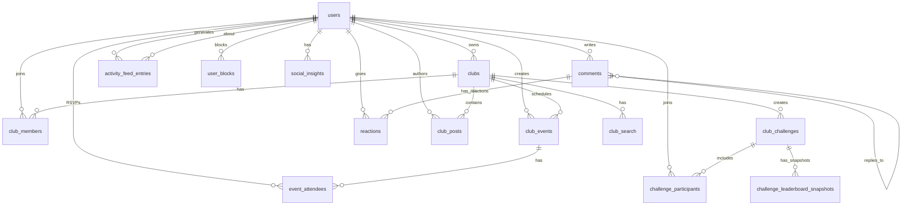

# Team A: Social Features Database Design
## Extended Schema for Clubs, Events, & Social Interactions

**Designer:** senior-database  
**Team:** Team A (Social Features & Gamification)  
**Date:** 2026-04-27  
**Schema Version:** Proposed extension to v0018

---

## 1. Clubs/Groups Domain

### clubs Table

```sql
CREATE TABLE clubs (
  id TEXT PRIMARY KEY,
  name TEXT NOT NULL,
  description TEXT,
  owner_id TEXT NOT NULL REFERENCES users(id) ON DELETE CASCADE,
  privacy_type TEXT NOT NULL DEFAULT 'public', -- 'public', 'private', 'invite_only'
  max_members INTEGER DEFAULT 100,
  avatar_url TEXT, -- R2 stored image
  banner_url TEXT, -- R2 stored banner
  location TEXT, -- City/region for local clubs
  website TEXT,
  created_at INTEGER NOT NULL,
  updated_at INTEGER NOT NULL
);

-- Indexes
CREATE INDEX idx_clubs_owner ON clubs(owner_id);
CREATE INDEX idx_clubs_privacy ON clubs(privacy_type);
CREATE INDEX idx_clubs_created ON clubs(created_at DESC);
```

**Rationale:**
- `owner_id` - Club creator (admin)
- `privacy_type` - Controls visibility/join requirements
- `max_members` - Capacity limit
- `location` - For discovering local clubs

---

### club_members Table

```sql
CREATE TABLE club_members (
  id TEXT PRIMARY KEY,
  club_id TEXT NOT NULL REFERENCES clubs(id) ON DELETE CASCADE,
  user_id TEXT NOT NULL REFERENCES users(id) ON DELETE CASCADE,
  role TEXT NOT NULL DEFAULT 'member', -- 'owner', 'admin', 'member', 'moderator'
  joined_at INTEGER NOT NULL,
  status TEXT NOT NULL DEFAULT 'active', -- 'active', 'banned', 'left'
  permissions TEXT, -- JSON: { can_post: true, can_invite: false, ... }
  UNIQUE(club_id, user_id)
);

-- Indexes
CREATE INDEX idx_club_members_club ON club_members(club_id);
CREATE INDEX idx_club_members_user ON club_members(user_id);
CREATE INDEX idx_club_members_role ON club_members(club_id, role);
CREATE INDEX idx_club_members_status ON club_members(status);
```

**Rationale:**
- Composite UNIQUE(club_id, user_id) prevents duplicate membership
- `role` enables tiered permissions
- Index on (club_id, role) for "get all admins" queries
- Index on user_id for "my clubs" queries

---

## 2. Events Domain

### club_events Table

```sql
CREATE TABLE club_events (
  id TEXT PRIMARY KEY,
  club_id TEXT NOT NULL REFERENCES clubs(id) ON DELETE CASCADE,
  created_by TEXT NOT NULL REFERENCES users(id), -- Event organizer
  title TEXT NOT NULL,
  description TEXT,
  event_type TEXT NOT NULL, -- 'workout', 'meetup', 'challenge', 'webinar'
  start_time INTEGER NOT NULL,
  end_time INTEGER NOT NULL,
  timezone TEXT DEFAULT 'UTC',
  location_type TEXT NOT NULL, -- 'virtual', 'in_person', 'hybrid'
  location_address TEXT, -- For in-person
  location_url TEXT, -- For virtual (Zoom, etc.)
  max_participants INTEGER,
  cost_type TEXT DEFAULT 'free', -- 'free', 'paid', 'sponsored'
  cost_amount REAL, -- If paid
  recurring_type TEXT, -- 'none', 'daily', 'weekly', 'monthly'
  recurring_interval INTEGER, -- Every N days/weeks
  recurring_end_date TEXT, -- ISO date
  image_url TEXT, -- Event banner
  created_at INTEGER NOT NULL,
  updated_at INTEGER NOT NULL
);

-- Indexes
CREATE INDEX idx_club_events_club ON club_events(club_id);
CREATE INDEX idx_club_events_start ON club_events(start_time);
CREATE INDEX idx_club_events_created ON club_events(created_at DESC);
CREATE INDEX idx_club_events_type ON club_events(event_type);
```

**Rationale:**
- `start_time`/`end_time` as Unix timestamps for edge queries
- `recurring_*` fields support recurring events
- Index on `start_time` for "upcoming events" queries
- Composite index (club_id, start_time) for club-specific upcoming

---

### event_attendees Table

```sql
CREATE TABLE event_attendees (
  id TEXT PRIMARY KEY,
  event_id TEXT NOT NULL REFERENCES club_events(id) ON DELETE CASCADE,
  user_id TEXT NOT NULL REFERENCES users(id) ON DELETE CASCADE,
  rsvp_status TEXT NOT NULL DEFAULT 'going', -- 'going', 'maybe', 'declined'
  attended INTEGER DEFAULT 0, -- 0=no, 1=yes (checked in)
  checkin_time INTEGER, -- When user confirmed attendance
  notes TEXT, -- User's notes (dietary restrictions, etc.)
  created_at INTEGER NOT NULL,
  UNIQUE(event_id, user_id)
);

-- Indexes
CREATE INDEX idx_event_attendees_event ON event_attendees(event_id);
CREATE INDEX idx_event_attendees_user ON event_attendees(user_id);
CREATE INDEX idx_event_attendees_status ON event_attendees(event_id, rsvp_status);
CREATE INDEX idx_event_attendees_attended ON event_attendees(event_id, attended);
```

**Rationale:**
- `rsvp_status` allows tentative/maybe responses
- `attended` tracks actual check-ins (for post-event analytics)
- Unique constraint prevents duplicate RSVPs
- Index on (event_id, rsvp_status) for "how many going?" queries

---

## 3. Comments & Reactions Domain

### comments Table

```sql
CREATE TABLE comments (
  id TEXT PRIMARY KEY,
  entity_type TEXT NOT NULL, -- 'workout', 'achievement', 'event', 'club_post', 'badge'
  entity_id TEXT NOT NULL, -- ID of the commented-on entity
  user_id TEXT NOT NULL REFERENCES users(id) ON DELETE CASCADE,
  parent_id TEXT REFERENCES comments(id) ON DELETE CASCADE, -- For nested replies
  content TEXT NOT NULL,
  mentions TEXT, -- JSON array of mentioned user IDs
  edit_count INTEGER DEFAULT 0,
  edited_at INTEGER,
  deleted_at INTEGER, -- Soft delete
  created_at INTEGER NOT NULL,
  updated_at INTEGER NOT NULL
);

-- Indexes
CREATE INDEX idx_comments_entity ON comments(entity_type, entity_id);
CREATE INDEX idx_comments_user ON comments(user_id);
CREATE INDEX idx_comments_parent ON comments(parent_id);
CREATE INDEX idx_comments_created ON comments(created_at DESC);
```

**Rationale:**
- `entity_type` + `entity_id` polymorphic association (single table for all comments)
- `parent_id` enables nested replies (threaded comments)
- Index on (entity_type, entity_id) for "get all comments on X"
- `deleted_at` soft delete preserves conversation flow

---

### reactions Table

```sql
CREATE TABLE reactions (
  id TEXT PRIMARY KEY,
  entity_type TEXT NOT NULL, -- 'comment', 'workout', 'achievement', 'post'
  entity_id TEXT NOT NULL,
  user_id TEXT NOT NULL REFERENCES users(id) ON DELETE CASCADE,
  reaction_type TEXT NOT NULL, -- 'like', 'love', 'haha', 'wow', 'sad', 'angry', 'clap', 'motivation'
  created_at INTEGER NOT NULL,
  UNIQUE(entity_type, entity_id, user_id, reaction_type)
);

-- Indexes
CREATE INDEX idx_reactions_entity ON reactions(entity_type, entity_id);
CREATE INDEX idx_reactions_user ON reactions(user_id);
CREATE INDEX idx_reactions_created ON reactions(created_at DESC);
```

**Rationale:**
- Multiple reaction types (Facebook-style) for richer engagement
- Unique constraint prevents duplicate same-reaction from same user
- Index on entity for "count reactions" queries
- Could extend to `reaction_counts` materialized table if hot

---

## 4. Activity Feed & News

### activity_feed_entries Table

```sql
CREATE TABLE activity_feed_entries (
  id TEXT PRIMARY KEY,
  user_id TEXT NOT NULL REFERENCES users(id) ON DELETE CASCADE,
  actor_id TEXT NOT NULL REFERENCES users(id), -- Who performed the action
  activity_type TEXT NOT NULL, -- 'workout_completed', 'badge_earned', 'goal_achieved', 'joined_club', 'post_created'
  entity_type TEXT, -- Optional: what the activity is about
  entity_id TEXT, -- Optional: ID of entity
  metadata TEXT NOT NULL, -- JSON: { title, description, image_url, data: {...} }
  is_public INTEGER DEFAULT 1, -- 0=private, 1=friends, 2=public
  created_at INTEGER NOT NULL
);

-- Indexes
CREATE INDEX idx_feed_user_created ON activity_feed_entries(user_id, created_at DESC);
CREATE INDEX idx_feed_actor ON activity_feed_entries(actor_id);
CREATE INDEX idx_feed_created ON activity_feed_entries(created_at DESC);
CREATE INDEX idx_feed_visibility ON activity_feed_entries(is_public);
```

**Rationale:**
- Denormalized activity stream for fast retrieval (fan-out pattern)
- `is_public` controls visibility (0=private, 1=friends-only, 2=public)
- `metadata` stores all display data (avoids JOINs for feed)
- Index on (user_id, created_at DESC) for "my feed" query
- Index on `actor_id` for "user's activity" profile

---

## 5. Club Challenges (Gamification Extension)

### club_challenges Table

```sql
CREATE TABLE club_challenges (
  id TEXT PRIMARY KEY,
  club_id TEXT NOT NULL REFERENCES clubs(id) ON DELETE CASCADE,
  created_by TEXT NOT NULL REFERENCES users(id),
  title TEXT NOT NULL,
  description TEXT,
  challenge_type TEXT NOT NULL, -- 'individual_total', 'team_accumulate', 'attendance Streak', 'workout_frequency'
  metric_type TEXT NOT NULL, -- 'workouts', 'minutes', 'calories', 'points', 'distance'
  target_value REAL NOT NULL, -- Target to achieve
  start_date TEXT NOT NULL, -- ISO date YYYY-MM-DD
  end_date TEXT NOT NULL, -- ISO date
  team_based INTEGER DEFAULT 0, -- 0=individual, 1=team
  max_teams INTEGER,
  created_at INTEGER NOT NULL,
  updated_at INTEGER NOT NULL
);

-- Indexes
CREATE INDEX idx_club_challenges_club ON club_challenges(club_id);
CREATE INDEX idx_club_challenges_dates ON club_challenges(start_date, end_date);
CREATE INDEX idx_club_challenges_created ON club_challenges(created_at DESC);
```

---

### challenge_participants Table

```sql
CREATE TABLE challenge_participants (
  id TEXT PRIMARY KEY,
  challenge_id TEXT NOT NULL REFERENCES club_challenges(id) ON DELETE CASCADE,
  user_id TEXT NOT NULL REFERENCES users(id) ON DELETE CASCADE,
  team_id TEXT, -- NULL for individual challenges
  current_value REAL DEFAULT 0,
  target_value REAL NOT NULL,
  completion_percentage REAL DEFAULT 0,
  status TEXT NOT NULL DEFAULT 'active', -- 'active', 'completed', 'dropped'
  joined_at INTEGER NOT NULL,
  completed_at INTEGER,
  UNIQUE(challenge_id, user_id)
);

-- Indexes
CREATE INDEX idx_challenge_participants_challenge ON challenge_participants(challenge_id);
CREATE INDEX idx_challenge_participants_user ON challenge_participants(user_id);
CREATE INDEX idx_challenge_participants_status ON challenge_participants(challenge_id, status);
CREATE INDEX idx_challenge_participants_progress ON challenge_participants(challenge_id, completion_percentage DESC);
```

---

### challenge_leaderboard_snapshots Table

```sql
CREATE TABLE challenge_leaderboard_snapshots (
  id TEXT PRIMARY KEY,
  challenge_id TEXT NOT NULL REFERENCES club_challenges(id) ON DELETE CASCADE,
  snapshot_date TEXT NOT NULL, -- ISO date
  snapshot_at INTEGER NOT NULL,
  rankings TEXT NOT NULL, -- JSON: [{ rank: 1, user_id: "xxx", value: 1000, team_id: "yyy" }]
  total_participants INTEGER NOT NULL,
  UNIQUE(challenge_id, snapshot_date)
);

-- Indexes
CREATE INDEX idx_challenge_snapshots_challenge ON challenge_leaderboard_snapshots(challenge_id);
CREATE INDEX idx_challenge_snapshots_date ON challenge_leaderboard_snapshots(snapshot_date);
CREATE INDEX idx_challenge_snapshots_created ON challenge_leaderboard_snapshots(snapshot_at DESC);
```

**Rationale:**
- Separate leaderboard snapshots to avoid expensive live ranking queries
- Daily snapshots enable historical progress tracking
- JSON `rankings` stores full leaderboard (materialized view pattern)

---

## 6. Club Communication

### club_posts Table

```sql
CREATE TABLE club_posts (
  id TEXT PRIMARY KEY,
  club_id TEXT NOT NULL REFERENCES clubs(id) ON DELETE CASCADE,
  author_id TEXT NOT NULL REFERENCES users(id),
  title TEXT,
  content TEXT NOT NULL,
  post_type TEXT DEFAULT 'announcement', -- 'announcement', 'discussion', 'question', 'celebration'
  attachment_type TEXT, -- 'image', 'video', 'poll', 'workout'
  attachment_url TEXT, -- R2 URL if media
  attachment_data TEXT, -- JSON for polls, workouts, etc.
  is_pinned INTEGER DEFAULT 0,
  is_announcement INTEGER DEFAULT 0,
  view_count INTEGER DEFAULT 0,
  comment_count INTEGER DEFAULT 0,
  like_count INTEGER DEFAULT 0,
  created_at INTEGER NOT NULL,
  updated_at INTEGER NOT NULL
);

-- Indexes
CREATE INDEX idx_club_posts_club ON club_posts(club_id);
CREATE INDEX idx_club_posts_author ON club_posts(author_id);
CREATE INDEX idx_club_posts_created ON club_posts(created_at DESC);
CREATE INDEX idx_club_posts_pinned ON club_posts(club_id, is_pinned DESC, created_at DESC);
```

**Rationale:**
- `post_type` categorizes content (UI displays differently)
- `is_pinned` allows sticky posts at top of club feed
- Materialized `*_count` columns avoid expensive COUNT(*) queries
- Index on (club_id, is_pinned, created_at) for "pinned first, then recent"

---

## 7. Notifications Enhancement (Extending Existing)

### notification_templates Table (for templated push notifications)

```sql
CREATE TABLE notification_templates (
  id TEXT PRIMARY KEY,
  type TEXT NOT NULL UNIQUE, -- 'friend_request', 'event_reminder', 'challenge_completed', etc.
  title_template TEXT NOT NULL, -- e.g., "{{actor}} completed a workout!"
  body_template TEXT NOT NULL,
  icon_url TEXT, -- R2 URL for notification icon
  action_label TEXT, -- e.g., "View", "RSVP", "Join"
  action_deep_link TEXT, -- App deep link: "app://workout/123"
  priority INTEGER DEFAULT 0, -- 0=normal, 1=high, 2=urgent
  is_active INTEGER DEFAULT 1
);

-- Indexes
CREATE INDEX idx_notification_templates_type ON notification_templates(type);
```

---

## 8. Privacy & Blocking

### user_blocks Table

```sql
CREATE TABLE user_blocks (
  id TEXT PRIMARY KEY,
  blocker_id TEXT NOT NULL REFERENCES users(id) ON DELETE CASCADE,
  blocked_id TEXT NOT NULL REFERENCES users(id) ON DELETE CASCADE,
  reason TEXT, -- 'inappropriate', 'harassment', 'spam', 'other'
  created_at INTEGER NOT NULL,
  UNIQUE(blocker_id, blocked_id)
);

-- Indexes
CREATE INDEX idx_user_blocks_blocker ON user_blocks(blocker_id);
CREATE INDEX idx_user_blocks_blocked ON user_blocks(blocked_id);
```

**Rationale:**
- Prevents blocked users from seeing each other's content
- Checked in application logic before showing content
- Unique constraint prevents duplicate blocks

---

## 9. Analytics & Insights (Social Metrics)

### social_insights Table (Materialized Social Stats)

```sql
CREATE TABLE social_insights (
  id TEXT PRIMARY KEY,
  user_id TEXT NOT NULL REFERENCES users(id) ON DELETE CASCADE,
  period TEXT NOT NULL, -- 'daily', 'weekly', 'monthly'
  period_start TEXT NOT NULL, -- ISO date
  period_end TEXT NOT NULL,
  
  -- Engagement metrics
  posts_created INTEGER DEFAULT 0,
  comments_made INTEGER DEFAULT 0,
  reactions_given INTEGER DEFAULT 0,
  reactions_received INTEGER DEFAULT 0,
  
  -- Social reach
  new_followers INTEGER DEFAULT 0,
  content_views INTEGER DEFAULT 0,
  content_shares INTEGER DEFAULT 0,
  
  -- Club activity
  clubs_joined INTEGER DEFAULT 0,
  events_attended INTEGER DEFAULT 0,
  challenge_participations INTEGER DEFAULT 0,
  
  calculated_at INTEGER NOT NULL,
  UNIQUE(user_id, period, period_start)
);

-- Indexes
CREATE INDEX idx_social_insights_user ON social_insights(user_id);
CREATE INDEX idx_social_insights_period ON social_insights(period, period_start);
```

**Rationale:**
- Pre-computed social analytics (avoid expensive real-time aggregation)
- Daily/weekly snapshots enable trend analysis
- Useful for gamification and user insights

---

## 10. Search & Discovery (Full-Text Search Alternative)

Since D1 lacks FTS, we'll use LIKE + trigram-like approach:

### club_search Table (Denormalized Search)

```sql
CREATE TABLE club_search (
  club_id TEXT PRIMARY KEY REFERENCES clubs(id) ON DELETE CASCADE,
  search_blob TEXT NOT NULL, -- Concatenated: name + description + location + member_names
  name TEXT NOT NULL,
  member_count INTEGER DEFAULT 0,
  is_public INTEGER NOT NULL,
  updated_at INTEGER NOT NULL
);

-- Indexes
CREATE INDEX idx_club_search_blob ON club_search(search_blob);
CREATE INDEX idx_club_search_members ON club_search(member_count DESC);
```

**Query Pattern:**
```sql
SELECT c.*, cs.member_count
FROM clubs c
JOIN club_search cs ON cs.club_id = c.id
WHERE cs.search_blob LIKE '%keyword%'
  AND c.is_public = 1
ORDER BY cs.member_count DESC
LIMIT 20;
```

---

## Complete ER Diagram (New Tables)



---

## Key Query Patterns & Indexes

### 1. Get User's Club Memberships
```sql
SELECT c.*, cm.role 
FROM clubs c
JOIN club_members cm ON cm.club_id = c.id
WHERE cm.user_id = ? AND cm.status = 'active';
```
**Indexes:** `idx_club_members_user`, `idx_club_members_club` ✅

---

### 2. Get Club's Public Events (Upcoming)
```sql
SELECT * FROM club_events
WHERE club_id = ?
  AND start_time > ?
  AND (is_public = 1 OR EXISTS (
    SELECT 1 FROM club_members 
    WHERE club_id = ? AND user_id = ? AND status = 'active'
  ))
ORDER BY start_time ASC;
```
**Indexes:** `idx_club_events_club`, `idx_club_events_start` ✅

---

### 3. Get Event Attendees (with RSVP counts)
```sql
SELECT 
  rsvp_status,
  COUNT(*) as count
FROM event_attendees
WHERE event_id = ?
GROUP BY rsvp_status;
```
**Index:** `idx_event_attendees_event` ✅

---

### 4. Get Activity Feed (Following + Clubs)
```sql
SELECT * FROM activity_feed_entries
WHERE user_id IN (
  SELECT friend_id FROM social_relationships 
  WHERE user_id = ? AND status = 'accepted'
  UNION
  SELECT club_id FROM club_members 
  WHERE user_id = ? AND status = 'active'
)
AND is_public IN (1, 2)  -- friends or public
AND created_at > ?
ORDER BY created_at DESC
LIMIT 50;
```
**Indexes:** `idx_feed_user_created`, `idx_club_members_user`, `idx_social_relationships_user` ✅

---

### 5. Get Club Leaderboard (with snapshot)
```sql
SELECT * FROM challenge_leaderboard_snapshots
WHERE challenge_id = ?
ORDER BY snapshot_date DESC
LIMIT 1;
```
**Index:** `idx_challenge_snapshots_challenge` ✅

---

## Migration Plan

### Steps:

1. **Create migration file** `0018_social_features.sql`
2. **Add tables** in order respecting foreign keys:
   - clubs
   - club_members
   - club_events
   - event_attendees
   - comments
   - reactions
   - activity_feed_entries
   - club_challenges
   - challenge_participants
   - challenge_leaderboard_snapshots
   - club_posts
   - notification_templates
   - user_blocks
   - social_insights
   - club_search

3. **Create indexes** for all tables

4. **Add DOWN migrations** (DROP TABLE in reverse order)

5. **Test locally:**
   ```bash
   pnpm run migrate:local
   pnpm run seed:mock  # Add social seed data
   ```

---

## Scalability Considerations

### Data Volume Estimates (100K users)

| Table | Estimated Rows | Growth Rate |
|-------|----------------|-------------|
| clubs | 5K | 0.05/user × 100K |
| club_members | 500K | 5 members/club avg |
| club_events | 50K | 1 event/club/month |
| event_attendees | 2M | 40 RSVPs/event avg |
| comments | 5M | 50 comments/user avg |
| reactions | 20M | 200 reactions/user avg |
| activity_feed_entries | 10M | 100 entries/user avg |

**Total estimated:** ~40M rows - well within D1's 10GB limit (~2-3GB actual)

---

## Security & Privacy

### Row-Level Security (Application-Level)

```typescript
// Always enforce club membership checks
const getClub = async (tx, clubId: string, userId: string) => {
  const club = await tx.select()
    .from(clubs)
    .where(eq(clubs.id, clubId))
    .limit(1);
  
  if (!club) throw new NotFoundError();
  
  // Check membership for private clubs
  if (club.privacy_type !== 'public') {
    const membership = await tx.select()
      .from(club_members)
      .where(
        and(
          eq(club_members.clubId, clubId),
          eq(club_members.userId, userId),
          eq(club_members.status, 'active')
        )
      );
    if (!membership) throw new ForbiddenError();
  }
  
  return club;
};
```

### Data Retention

- **Comments:** Soft delete (`deleted_at`) - keep for thread integrity
- **Activity Feed:** Archive >1 year old to R2 as JSON
- **Event Attendees:** Purge after event + 90 days (unless needed for analytics)
- **Reactions:** Keep indefinitely (low storage cost)

---

## Next Steps

1. ✅ **Review schema design** with team-lead and senior-hono
2. ⏭️ **Create actual migration file** after approval
3. ⏭️ **Update seed script** with social fixture data
4. ⏭️ **Coordinate with senior-security** on privacy controls
5. ⏭️ **Work with senior-hono** on API query patterns

---

## Questions for Team A

1. **Club Roles:** Need more granular permissions? (moderator, event_admin, content_moderator)
2. **Event Types:** Any specific event types missing? (group_workout, race, competition)
3. **Reactions:** Custom reaction types? Or stick to standard emojis?
4. **Privacy:** Need "blocked user can't see my posts" enforcement in queries?
5. **Analytics:** Additional social metrics needed for gamification?

---

**Status:** Draft ready for review  
**Owner:** senior-database  
**Target Completion:** Within 24 hours per assignment
